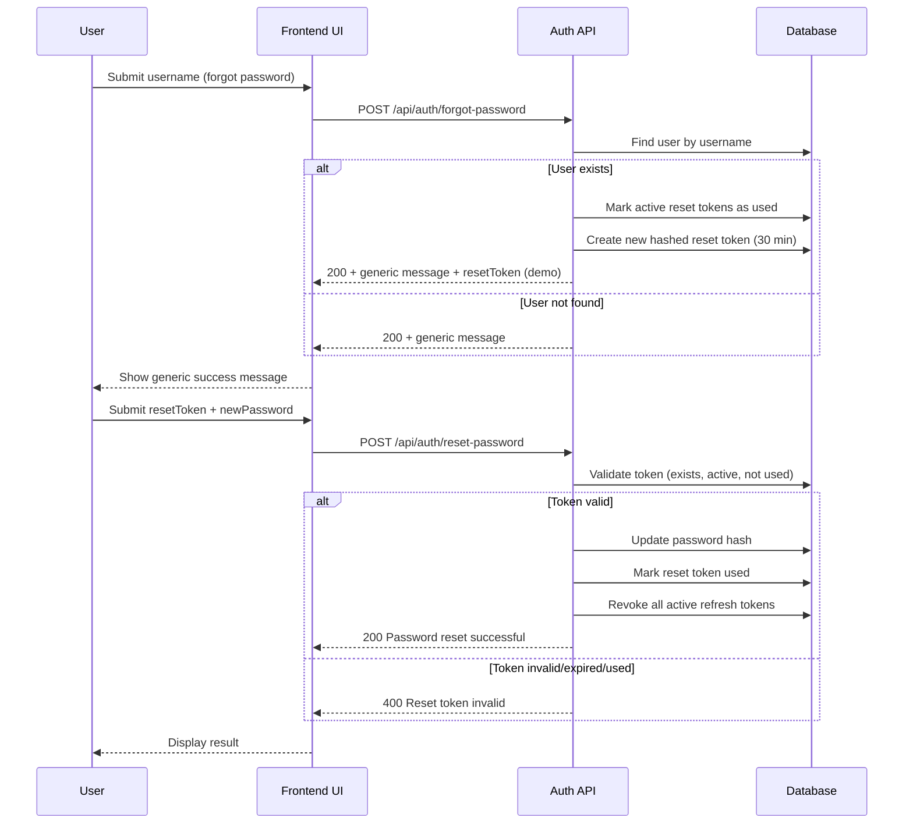

# ToDoManagement

Full-stack task management application with:
- Backend: .NET 8 Web API, EF Core + SQLite, JWT authentication
- Frontend: React + TypeScript + Vite + Axios

## Required Versions

- .NET SDK: **8.0** (or newer 8.0.x patch)
- EF Core packages: **8.0.20**
- EF CLI: **dotnet-ef 8.0.20**

## Features

- User registration and login with JWT access token + refresh token issuance.
- Refresh token rotation (`POST /api/auth/refresh`) and explicit revocation (`POST /api/auth/revoke`).
- Forgot/reset password flow with one-time reset tokens:
  - `POST /api/auth/forgot-password` invalidates any existing active reset tokens for the user, creates a new token, stores only a hash, and returns a generic success response.
  - `POST /api/auth/reset-password` validates one-time token usage/expiration, resets password, marks token used, and revokes all active refresh tokens for that user.
- Password policy enforcement on register and reset:
  - Minimum 8 characters
  - At least 1 letter
  - At least 1 number
  - At least 1 special character
- Passwords are stored at rest as salted PBKDF2 (SHA-256) hashes, never plaintext.
- Authenticated task CRUD scoped to the logged-in user.
- Task filtering via `GET /api/tasks` query parameters:
  - `search` (matches title/description)
  - `status` (`open`, `completed`, or `all`)
- Dashboard split view for open tasks + expandable completed tasks section with lazy loading.
- Overdue due-date highlighting in the dashboard.
- Profile management for authenticated users:
  - Update full name
  - Optional password change when current password is provided
  - Username is immutable
- Task audit metadata:
  - `CreatedDateUtc`
  - `UpdatedDateUtc`
- Application-managed temporal history (`TaskItemHistory`) for update/delete snapshots.
- Strongly typed JWT settings via `JwtTokenDto` (`IOptions<JwtTokenDto>`).
- Migration-based schema updates on startup (uses `Database.Migrate()`).
- Validation using FluentValidation for auth and task payloads.

## Project Structure

```text
ToDoManagement/
├── backend/
│   ├── Controllers/
│   ├── Data/
│   ├── Dtos/
│   ├── Migrations/
│   ├── Models/
│   ├── Services/
│   ├── Validators/
│   └── tests/
├── frontend/
│   ├── src/
│   │   ├── components/
│   │   ├── services/
│   │   ├── test/
│   │   ├── types/
│   │   └── ...
│   └── ...
└── ...
```

## Backend Setup

1. Open terminal in `backend/`.
2. Restore and build:

```bash
dotnet restore
dotnet build
```

3. Run API:

```bash
dotnet run
```

Startup applies pending migrations automatically.

4. API base URL (default):
- `http://localhost:5000` (or URL shown by `dotnet run` output)

Swagger is enabled in Development.

## EF Migrations

This project uses EF Core migrations for schema changes over time (including SQLite).

### Required Packages and Tools

From `backend/ToDoManagement.Api.csproj`:

- `Microsoft.EntityFrameworkCore.Sqlite` **8.0.20**
- `Microsoft.EntityFrameworkCore.Design` **8.0.20**

CLI tool required to scaffold/apply migrations:

```bash
dotnet tool install --global dotnet-ef --version 8.0.20
dotnet tool update --global dotnet-ef --version 8.0.20
dotnet ef --version
```

If your machine cannot use global tools, install a local tool manifest and local `dotnet-ef` tool.

### Generate a Migration

Run from `backend/`:

```bash
dotnet ef migrations add <MigrationName>
```

Example for the `FullName` column update:

```bash
dotnet ef migrations add AddUserFullNameColumn
```

### Apply Migrations to the Database

Run from `backend/`:

```bash
dotnet ef database update
```

### Useful Migration Commands

List migrations:

```bash
dotnet ef migrations list
```

Rollback to a previous migration (or `0` for empty schema):

```bash
dotnet ef database update <MigrationNameOr0>
```

Remove the last migration (before it is applied to shared environments):

```bash
dotnet ef migrations remove
```

### Notes for This Repository

- `User.FullName` is configured as `VARCHAR(100)` to align with the UI's 100-character limit.
- The migration files are located under `backend/Migrations/`.
- For existing local databases created before this column existed, run `dotnet ef database update` to add the missing column.

## Frontend Setup

1. Open terminal in `frontend/`.
2. Install dependencies:

```bash
npm install
```

3. Start dev server:

```bash
npm run dev
```

4. Open Vite URL shown in terminal (default `http://localhost:5173`).

## Database Initialization

- Database provider: SQLite (`backend/tasks.db`)
- Initialization strategy: EF Core migrations (`Migrate()` at startup)
- Result: pending migrations are applied automatically when the API starts

## Authentication Endpoints

- `POST /api/auth/register`
  - Body: `{ "fullName": "string", "username": "string", "password": "string" }`
  - Returns: `{ id, fullName, username, token, refreshToken }`
- `POST /api/auth/login`
  - Body: `{ "username": "string", "password": "string" }`
  - Returns: `{ id, fullName, username, token, refreshToken }`
- `POST /api/auth/refresh`
  - Body: `{ "refreshToken": "string" }`
  - Returns: `{ id, fullName, username, token, refreshToken }`
  - Behavior: revokes the previous refresh token and issues a new one.
- `POST /api/auth/revoke`
  - Body: `{ "refreshToken": "string" }`
  - Revokes the specified refresh token.
- `POST /api/auth/forgot-password`
  - Body: `{ "username": "string" }`
  - Returns generic success message to reduce account enumeration risk.
  - Demo behavior: also returns a `resetToken` so flow can be tested without email integration.
- `POST /api/auth/reset-password`
  - Body: `{ "resetToken": "string", "newPassword": "string" }`
  - Validates one-time reset token, updates password hash, marks token used, and revokes all active refresh tokens for that user.

## Forgot Password Flow (Detailed)

### Sequence Diagram



1. User submits username to `POST /api/auth/forgot-password`.
2. API always returns a generic success message, whether user exists or not.
3. If user exists:
   - Any active reset tokens for the user are marked used.
   - New reset token is generated.
   - Only token hash is stored in `PasswordResetTokens` with 30-minute expiry.
   - Plain reset token is returned in response for local/demo usage.
4. User submits reset token + new password to `POST /api/auth/reset-password`.
5. API verifies token exists, is not expired, and has not been used.
6. Password hash is replaced with new PBKDF2 hash.
7. Reset token is marked used.
8. All active refresh tokens for that user are revoked, forcing re-authentication on other sessions.

## Task Endpoints

All endpoints require Bearer token.

- `GET /api/tasks`
  - Returns tasks for the current authenticated user only.
  - Optional query params:
    - `search`: filters by title/description
    - `status`: `open`, `completed`, or `all`
- `POST /api/tasks`
  - Body: `{ title, description, dueDate? }`
  - The task is always tied to the current authenticated user.
- `PUT /api/tasks/{id}`
  - Current authenticated user only.
  - Body: `{ title, description, dueDate?, isCompleted }`
- `DELETE /api/tasks/{id}`
  - Current authenticated user only.

Task responses include: `{ id, title, description, dueDate, isCompleted, createdDateUtc, updatedDateUtc }`.

## Profile Endpoint

All endpoints require Bearer token.

- `PUT /api/auth/profile`
  - Body: `{ "fullName": "string", "currentPassword"?: "string", "newPassword"?: "string" }`
  - Behavior:
    - Full name is updated when valid.
    - Password changes are optional.
    - If `newPassword` is provided, `currentPassword` is required and must match.
    - Username is not editable.

## Frontend Notes

- Auth is route-based:
  - `/` login screen (default)
  - `/register` registration screen
  - `/forgot-password` forgot-password request screen
  - `/reset-password` reset-password screen (available only after a successful forgot-password request in the current app session)
  - `/tasks` authenticated dashboard
  - `/create-task` authenticated create-task page
  - `/profile` authenticated profile page
- Login view includes inline links under Password: `Register` (left) and `Forgot Password?` (right).
- JWT is stored client-side and sent as `Authorization: Bearer <token>`.
- Header includes a profile dropdown with full name + logout actions.

## Testing

### Backend Tests (xUnit + FluentAssertions)

Run from `backend/`:

```bash
dotnet test .\tests\ToDoManagement.Api.Tests\ToDoManagement.Api.Tests.csproj --property:WarningLevel=0 --logger "console;verbosity=minimal"
```

Coverage includes:
- Auth payload and password policy validation.
- Password hashing/verification behavior.
- Password reset token activity rules.

### Frontend Tests (Vitest + Testing Library + MSW)

Run from `frontend/`:

```bash
npm run test
```

Coverage includes:
- Registration form behavior.
- Forgot/reset password form behavior.
- Profile form behavior.
- Header dropdown behavior.
- Route rendering behavior for authenticated pages.
- API service calls with MSW handlers (including profile update and task filtering behavior).

## Assumptions

- SQLite is used for local persistence (`tasks.db`).
- SQLite does not provide SQL Server temporal tables, so temporal behavior is application-managed via `TaskItemHistory`.
- Forgot-password email delivery is intentionally out of scope for this repo; token return is demo-only.

## Limitations

- Refresh token and access token are stored in browser `localStorage` for demo simplicity.
- No pagination for task lists.
- Single environment-focused configuration.

## Future Improvements

- Replace demo reset-token return with real email/SMS provider integration.
- Add rate limiting and abuse protections around auth endpoints.
- Add integration tests for auth controller and token lifecycle.
- Add role-based authorization and stricter revoke authorization semantics.
